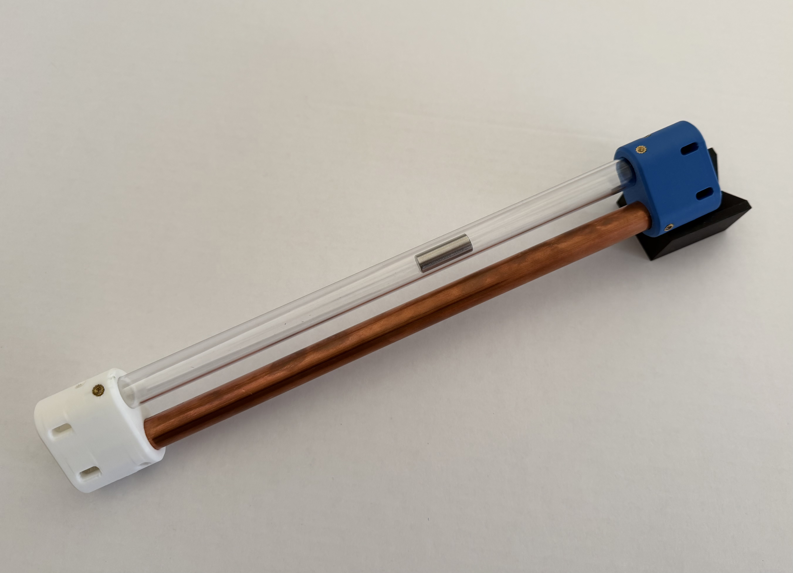

# Dual-Tube Lenz's Law Visualizer
**An open-source hardware initiative by OpenApparatus(https://openapparatus.org/)**

> As of May 2026, twelve beta units of this apparatus have been successfully deployed to universities, museums, and high schools across ten states. To ensure long-term reliability in educational environments, the hardware undergoes rigorous evaluation, including a 4,000-cycle automated stress test utilizing a motorized, Arduino-controlled rig, as linked below:

https://www.youtube.com/watch?v=3sY6RCX2NQ0

A ruggedized, student-built, and user-friendly physics apparatus designed to safely visualize eddy currents and magnetic braking in a classroom setting. 

When a permanent rare-earth magnet falls through the copper tube, the changing magnetic field induces massive eddy currents in the conductive wall through a small air gap. This creates an opposing magnetic force that acts as an "invisible parachute" or "invisible brake." Simultaneously, a non-magnetic 316 stainless steel control weight free-falls through a parallel clear polycarbonate tube, providing a real-time contrast in velocity. 

The control weight touches down almost instantly with a sharp acoustic signal and hard landing, while the magnet's soft landing is dramatically delayed by several seconds due to the magnetic braking effect. Both descents can be confirmed visually through the 3D-printed slotted viewing windows, with the clear tube offering full visual acuity of the free-fall baseline.

Built entirely from easily sourced off-the-shelf hardware and two custom 3D-printed end caps, this kit is perfect for high school physics demonstrations, hands-on STEM outreach, electromagnetic modeling, and kinematics calculations. 

I built this project as a high school junior to deepen my understanding of physics, practice hands-on design, and develop a clear way to communicate scientific ideas through hardware.

## 📁 Overview

This repository currently contains the print-ready STL and documentation for **v1**. *If editable CAD/source files are released in future versions, they will be added here.*

**Included files:**
* `cap_lenz_visualizer_v2.stl` — 3D-printable hardware component
* `README.md` — Project overview, safety notes, and build guidance
* `assets/hero-image.jpeg.png` — Prototype image

## 💡 Motivation

I enjoy building physical models that make abstract science ideas easier to see and explain. This project combines physics, mechanical design, 3D printing, and technical communication. It is part of my broader interest in using hardware to turn mathematical and physical concepts into tangible learning experiences.

## ⚠️ Safety & Liability
* **Captive System:** The strong magnet is securely housed by the screwed-on 3D-printed end caps, entirely eliminating the shatter, sharp edges, and pinch-point hazards commonly seen in such demonstrations.
* **Medical Warning:** The finished apparatus contains a powerful rare-earth magnet, which tends to attract ferromagnetic objects and debris. Keep strictly at least 12 inches away from pacemakers, ICDs, and other implanted medical devices.
* **Hot Surfaces & Sharp Edges:** Assembly requires a soldering iron and mechanical cutting tools. Handle hot surfaces and deburred metal edges with extreme caution.

## 🛠️ Bill of Materials (Per Kit)
**Hardware:**
* 1x Copper Tube: Nominal 1/2" (usually oversized) Type L or Type M (Actual OD ~5/8"), cut to 12 inches.
* 1x Clear Tube: Polycarbonate, 5/8" OD x 1/2" ID x 1/16" Wall, cut to 12 inches.
* 1x Magnet: Neodymium Cylinder, 1/2" Nominal Diameter (usually undersized) x 1.00" Height.
* 1x Control Weight: 316 Stainless Steel Dowel Pin, 10mm x 28mm.

**Fasteners (For 2 End Caps):**
* 6x Ruthex M3 Threaded Inserts (RX-M3x5x4 Brass Heat-Set).
* 6x M3-0.5 x 5mm Hex Socket Set Screws (Cup Point).

**3D-Printed Parts:**
* 2x End Caps (See `.stl` file).

## 🖨️ 3D-Printer Settings (PETG Filament Recommended)
* **Strength - Wall Loops:** 6 (Forces solid plastic walls around fastener holes to prevent blowout).
* **Strength - Sparse Infill:** 18% Density, Gyroid Pattern.

## ⚙️ Assembly Procedures

**Required Tools & Accessories:**
* Tubing Cutter (Suitable for copper and plastic)
* Reaming Pen / Deburring Tool
* Smart Mini Portable Soldering Iron
* Loctite 242 (Blue Removable Threadlocker)
* Metric Hex Key (For M3 set screws)
* Caliper and Tape Measure

**Assembly Steps:**
1. **Prepare the Tubes:** Cut both the copper and polycarbonate tubes to exactly 12 inches in length. Use the reaming pen to thoroughly deburr the inside and outside edges of all cut ends.
2. **Install the Inserts:** Using the soldering iron, carefully and gently press the brass inserts into the printed holes on the 3D-printed end caps until they are flush with the plastic. Ensure the inserts remain perpendicular to the mating surface as they cool. Use the proper iron temperature for your selected 3D print filament.
3. **Seat the Tubes:** Insert the copper and polycarbonate tubes into the bottom end cap. Gently tap until the tube ends meet the internal step stopper. *Note: The end cap cavities are asymmetric to account for material tolerances. The copper tube seats into the tighter cavity, while the polycarbonate tube seats into the looser cavity. Do not force polycarbonate tube into tighter cavity.*
4. **Load the Weights:** Drop the permanent magnet into the copper tube and the stainless steel control weight into the polycarbonate tube.
5. **Cap the System:** Press the top end cap onto the exposed ends of both tubes to seal the apparatus. Ensure the asymmetric hole cavities are correctly aligned with their respective tubes before pressing down. 
6. **Lock it Down:** Apply a small drop of Blue Loctite to the tip of set screws and thread them into the brass inserts until they sit flush against the tubing. It's the contact force between set screw tips and copper tube surface that provides the fastening force. However, no need to overtighten them. *(Note: There are no fastening holes on the polycarbonate side. Experience shows that the set screws against the copper tube are sufficient to keep the apparatus from separating.).*

The assembly is now complete and ready for classroom deployment.

---

## 📌 Versioning
* **v1** — Initial public prototype release.

*Future releases may include revised geometry, improved fit/tolerances, editable CAD/source files, and clearer classroom documentation.*

## 📄 License
This project is licensed under the **CERN Open Hardware Licence Version 2 - Weakly Reciprocal (CERN-OHL-W-2.0)**. Please see the `LICENSE` file for the full license text.

## ✍️ Attribution
Created by Jonathan Liu. If you build from or adapt this project, please preserve attribution and clearly indicate your modifications.

## 📝 Notes
This repository is meant to document an authentic learning and design process. The project may evolve over time as testing, classroom use, and fabrication experience lead to improvements.

## 🌍 Get Involved with OpenApparatus

This repository is maintained by the **OpenApparatus** engineering team. We are dedicated to removing the financial barriers to advanced physics and engineering education.

* **Educators:** Want to deploy this hardware in your classroom? [Request a Beta-Test Donation](https://openapparatus.org/beta.html).
* **Students:** Want to manufacture these kits for underfunded schools in your area? [Apply for a Chapter Scholarship](https://forms.gle/qhK3gqmmLUcHkoYXA).
* **Learn More:** Visit [openapparatus.org](https://openapparatus.org/) to see our full library of open-source STEM modules and our latest deployment impact metrics.