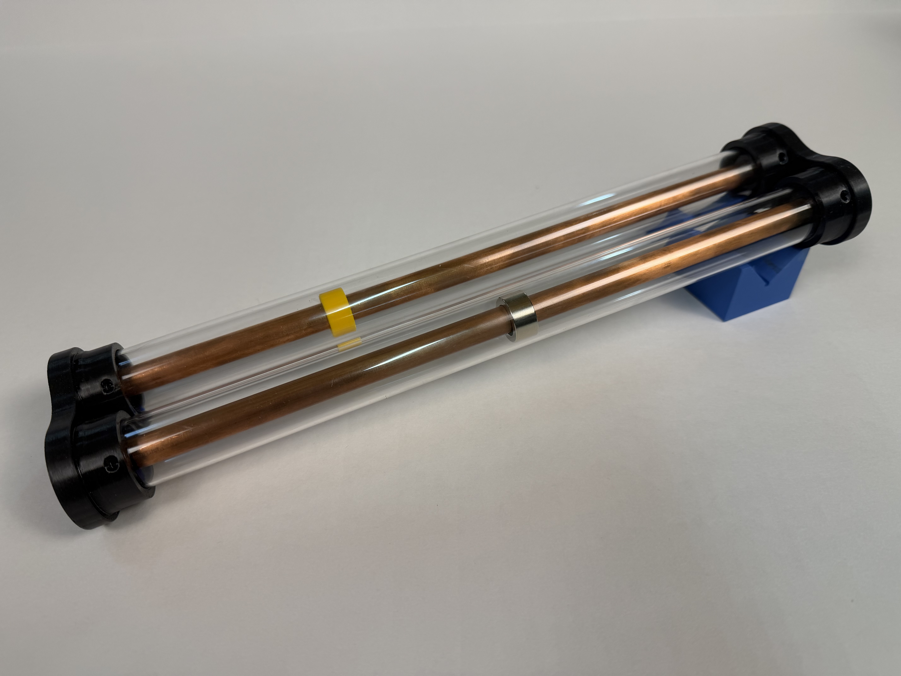

# Lenz’s Law Visualizers

**An open-source hardware initiative by [OpenApparatus](https://openapparatus.org/)**

Three classroom designs demonstrate eddy currents and magnetic braking. Each
includes printable parts, a materials list, photographs, and assembly instructions.

## Choose a design

| Design | Published version | Description | Build guide and files |
| --- | --- | --- | --- |
| Dual-tube | v1 | Compare a magnet descending through copper tube with a control weight falling through a clear tube. | [View dual-tube design](designs/dual-tube-design/README.md) |
| Triple-tube | v1 | Compare a control weight in a clear tube with magnets descending through aluminum and copper tubes; the control falls fastest and the copper-tube magnet slowest. | [View triple-tube design](designs/triple-tube-design/README.md) |
| See-through | v1 | Watch a ring magnet and a nonmagnetic control ring descend around matching copper tubes inside clear tubes, making magnetic braking directly visible. | [View see-through design](designs/see-through-design/README.md) |

### Dual-tube visualizer

[](designs/dual-tube-design/README.md)

[Build guide](designs/dual-tube-design/README.md) ·
[End-cap STL](designs/dual-tube-design/parts/cap_lenz_visualizer_v2.stl) ·
[Optional control-weight STL](designs/dual-tube-design/parts/control_weight_cylinder_3D_print_v1.stl)

[Watch the animation (22.5 seconds)](https://jsxliu.github.io/lenz-law-visualizer/designs/dual-tube-design/animation/):
a real-time fall followed by a quarter-speed slow-motion replay.
The player includes a **Download video (MP4)** link.
See the [animation notes](designs/dual-tube-design/animation/README.md)
for its parameters, assumptions, and credits.

### Triple-tube visualizer

[](designs/triple-tube-design/README.md)

[Build guide and print files](designs/triple-tube-design/README.md).
Adds an aluminum tube for comparison with the copper and clear tubes.

### See-through visualizer

[](designs/see-through-design/README.md)

[Build guide and print files](designs/see-through-design/README.md).
Clear outer tubes keep the ring magnet and control ring enclosed and visible throughout their falls.

## Repository layout

```text
README.md                       Overview and design comparison
CITATION.cff                   Citation metadata for GitHub
LICENSE                         Shared hardware license
designs/
   dual-tube-design/
     README.md                  Existing design’s build guide
     parts/                     Printable STL files
     images/                    Prototype photograph
   triple-tube-design/
     README.md                  v1 build guide
     parts/                     Printable STL files
     images/                    Prototype photograph
   see-through-design/
     README.md                  v1 build guide
     parts/                     Printable STL files
     images/                    Prototype photograph
```

## Citation

Use GitHub’s **Cite this repository** menu or [CITATION.cff](CITATION.cff).
Include the design and version when citing a particular build, such as **Dual-Tube Design, v1**.

Suggested general citation:

> Liu, Jonathan. *Lenz’s Law Visualizers*. OpenApparatus, 2026. [https://github.com/jsxliu/lenz-law-visualizer](https://github.com/jsxliu/lenz-law-visualizer).

## License and attribution

- Hardware designs and build documentation: [CERN-OHL-W-2.0](LICENSE).
- Animation text, video, poster, and synthesized sound: [CC BY 4.0](designs/dual-tube-design/animation/LICENSE-media).
- Animation viewer and publication workflow: [MIT](designs/dual-tube-design/animation/LICENSE-viewer).

See the [animation credits](designs/dual-tube-design/animation/credits.md) for sources and attribution.

Created by Jonathan Liu. If you build from or adapt this project, please preserve attribution and clearly indicate your modifications.

## Community acknowledgements

Thank you to educators who tested beta builds, built their own versions, and
shared feedback, and to participants at Maker Faires, FAB26 in Boston, and
classroom and university mini-workshops. Their experiences help improve these designs.

## AI assistance

AI tools assisted with drafting documentation, refactoring code, and creating visuals. Jonathan Liu at OpenApparatus directs the project and retains responsibility for design decisions, physical testing, and published content.

## Get involved with OpenApparatus

* **Educators:** [Request a Beta-Test Donation](https://openapparatus.org/beta.html).
* **Students:** [Apply to Start a Chapter](https://forms.gle/mwWGrnZB5XusfW3L9).
* **Learn more:** Visit [openapparatus.org](https://openapparatus.org/).
