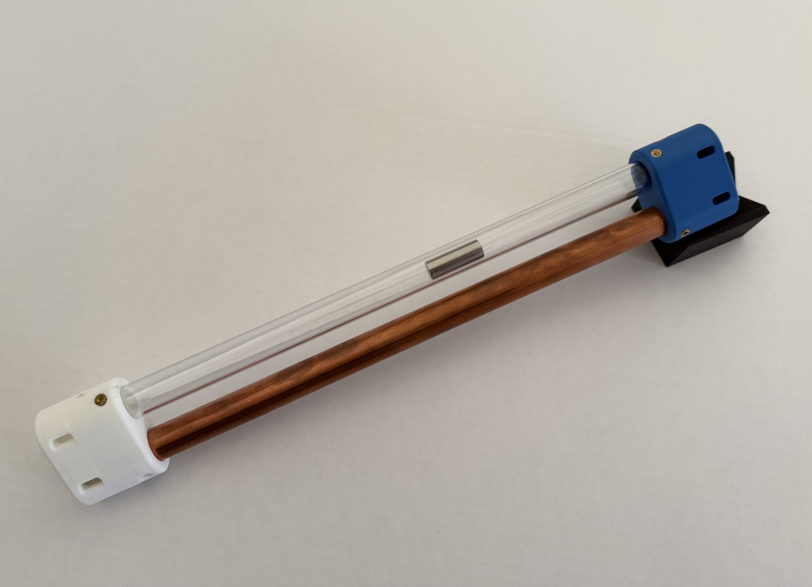
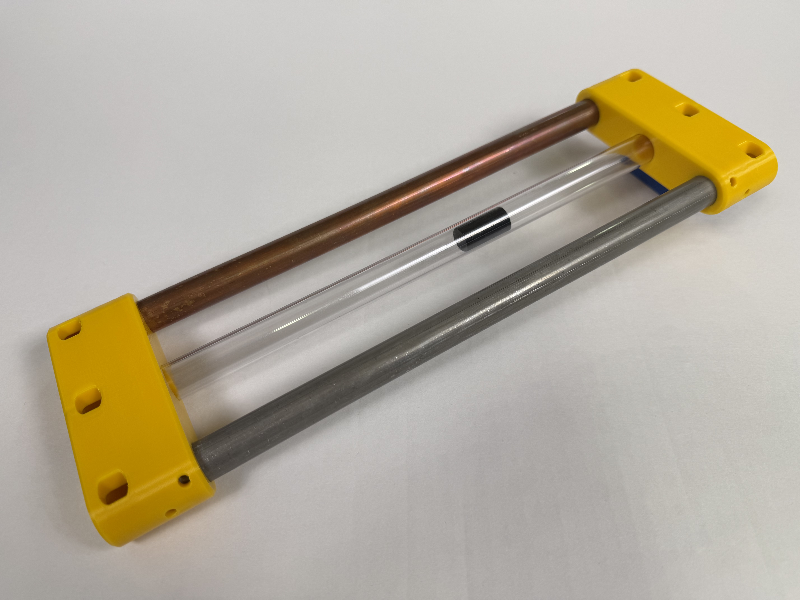

# Lenz’s Law Visualizers

**An open-source hardware initiative by [OpenApparatus](https://openapparatus.org/)**

This repository began with the dual-tube Lenz’s Law visualizer and now includes multiple design variations for demonstrating eddy currents and magnetic braking in physics classrooms. Each design has its own version history, printable parts, images, materials list, and assembly instructions.

## Choose a design

| Design | Published version | Description | Build guide and files |
| --- | --- | --- | --- |
| Dual-tube | v1 | Compare a magnet descending through copper tube with a control weight falling through a clear tube. | [View dual-tube design](designs/dual-tube-design/README.md) |
| Triple-tube | v1 | Compare a control weight in a clear tube with magnets descending through aluminum and copper tubes; the control falls fastest and the copper-tube magnet slowest. | [View triple-tube design](designs/triple-tube-design/README.md) |

### Dual-tube visualizer

[](designs/dual-tube-design/README.md)

The dual-tube design’s [build guide](designs/dual-tube-design/README.md) includes materials, printing settings, assembly instructions, safety notes, deployment evidence, and stress-test information. Download the [end-cap STL](designs/dual-tube-design/parts/cap_lenz_visualizer_v2.stl) and the [optional control-weight STL](designs/dual-tube-design/parts/control_weight_cylinder_3D_print_v1.stl) directly.

### Triple-tube visualizer

[](designs/triple-tube-design/README.md)

The [triple-tube v1 build guide](designs/triple-tube-design/README.md) includes materials, printing settings, assembly instructions, safety notes, a prototype photograph, and printable parts. This variation adds an aluminum tube alongside the copper and clear tubes, allowing a qualitative comparison of magnetic braking in the two conductive-tube assemblies. It reuses components from the dual-tube design wherever practical.

## Repository layout

```text
README.md                       Overview and design comparison
CITATION.cff                   Citation metadata for GitHub
LICENSE                         Shared hardware license
designs/
   dual-tube-design/
     README.md                  Existing design’s build guide
     parts/                     Printable STL files
     images/                    Prototype photograph
   triple-tube-design/
     README.md                  v1 build guide
     parts/                     Printable STL files
     images/                    Prototype photograph
```

## Citation

Use GitHub’s **Cite this repository** menu to copy an APA or BibTeX citation generated from [CITATION.cff](CITATION.cff). When citing a particular build, also name the design and version used, such as **Dual-Tube Design, v1** or **Triple-Tube Design, v1**.

Suggested general citation:

> Liu, Jonathan. *Lenz’s Law Visualizers*. OpenApparatus, 2026. [https://github.com/jsxliu/lenz-law-visualizer](https://github.com/jsxliu/lenz-law-visualizer).

## License and attribution

Licensed under the [CERN Open Hardware Licence Version 2 – Weakly Reciprocal (CERN-OHL-W-2.0)](LICENSE).

Created by Jonathan Liu. If you build from or adapt this project, please preserve attribution and clearly indicate your modifications.

## Get involved with OpenApparatus

* **Educators:** [Request a Beta-Test Donation](https://openapparatus.org/beta.html).
* **Students:** [Apply to Start a Chapter](https://forms.gle/mwWGrnZB5XusfW3L9).
* **Learn more:** Visit [openapparatus.org](https://openapparatus.org/).
