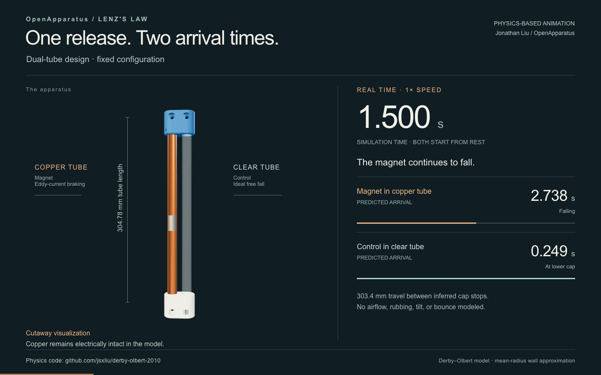

# Dual-Tube Lenz's Law Visualizer

**An open-source hardware initiative by [OpenApparatus](https://openapparatus.org/)**

[← All designs](../../README.md)

**Status:** Public prototype · **Design version:** v1

As of September 2026, 20 beta units have been deployed to universities,
museums, and high schools across 13 states and 3 countries. Testing
includes a [4,000-cycle automated stress test](https://www.youtube.com/watch?v=3sY6RCX2NQ0)
using a motorized, Arduino-controlled rig.

A ruggedized, student-built, and user-friendly physics apparatus designed to safely visualize eddy currents and magnetic braking in a classroom setting.

When a permanent rare-earth magnet falls through the copper tube, the changing magnetic field induces massive eddy currents in the conductive wall through a small air gap. This creates an opposing magnetic force that acts as an "invisible parachute" or "invisible brake." Simultaneously, a non-magnetic control weight free-falls through a parallel clear polycarbonate tube, providing a real-time contrast in velocity. Builders can use either the original off-the-shelf 316 stainless steel dowel pin or the included 3D-printable control weight.

The control weight reaches the opposite end almost instantly, while the magnet's soft landing is dramatically delayed by several seconds due to the magnetic braking effect. Both descents can be confirmed visually through the 3D-printed slotted viewing windows, with the clear tube offering full visual acuity of the free-fall baseline.

Built entirely from easily sourced off-the-shelf hardware and two custom 3D-printed end caps, this kit is perfect for high school physics demonstrations, hands-on STEM outreach, electromagnetic modeling, and kinematics calculations.

I built this project as a high school junior to deepen my understanding of physics, practice hands-on design, and develop a clear way to communicate scientific ideas through hardware.

## Physics-based animation

**[Watch the animation (22.5 seconds)](https://jsxliu.github.io/lenz-law-visualizer/designs/dual-tube-design/animation/)**

The player includes a **Download video (MP4)** link.

This fixed simulation serves as a first-order digital twin, showing a real-time
fall and quarter-speed replay. Calculations use the
[Derby–Olbert reproduction](https://github.com/jsxliu/derby-olbert-2010).
Predicted arrivals are **2.738 s** for the magnet and **0.249 s** for the control.
The copper cutaway is visual only; the modeled wall remains electrically intact.

The film represents one configuration; hardware dimensions and results can vary.
See its [parameters and assumptions](animation/scenario.md) and
[credits and licenses](animation/credits.md).

## Print files

* [cap_lenz_visualizer_v2.stl](parts/cap_lenz_visualizer_v2.stl) — 3D-printable end cap; print two
* [control_weight_cylinder_3D_print_v1.stl](parts/control_weight_cylinder_3D_print_v1.stl) — Optional 3D-printable control weight; print one

## Safety

* **Captive System:** The end caps and fasteners keep the magnet and control weight enclosed, reducing shatter, impact, and pinch hazards. Inspect the caps, tubes, inserts, and fasteners before every demonstration, and do not use the apparatus if any part is cracked, loose, or damaged.
* **Strong Magnets:** Keep the apparatus away from implanted medical devices, magnetic storage, electronics, and ferromagnetic objects. Follow the magnet manufacturer’s handling and separation guidance.
* **Pinch, Impact, and Shatter Hazards:** Keep fingers and loose metal objects away from the magnet. Do not use a cracked or chipped magnet.
* **Hot Surfaces & Sharp Edges:** Assembly requires a soldering iron and mechanical cutting tools. Wear appropriate protection and handle hot tools and metal edges carefully.
* **Supervision:** Assemble and operate the apparatus under qualified adult supervision.

## Bill of materials (per kit)

**Hardware:**

* 1x Copper Tube: Nominal 1/2-inch Type L or Type M, with a 5/8-inch outside diameter, cut to 12 inches. See the [Copper Tube Handbook](https://www.copper.org/publications/pub_list/pdf/copper_tube_handbook.pdf) for standard dimensions.
* 1x Clear Tube: Polycarbonate, 5/8" OD x 1/2" ID x 1/16" Wall, cut to 12 inches.
* 1x Magnet: Neodymium Cylinder, 1/2" Nominal Diameter x 1.00" Height.
* 1x Control Weight — choose one option:
  * **Off-the-shelf:** 316 stainless steel dowel pin matching the nominal size of the magnet.
  * **3D-printed:** Print [control_weight_cylinder_3D_print_v1.stl](parts/control_weight_cylinder_3D_print_v1.stl).

**Fasteners (For 2 End Caps):**

* 6x Ruthex M3 Threaded Inserts (RX-M3x5x4 Brass Heat-Set).
* 6x M3-0.5 x 5mm Hex Socket Set Screws (Cup Point).

**3D-Printed Parts:**

* 2x End Caps: Print [cap_lenz_visualizer_v2.stl](parts/cap_lenz_visualizer_v2.stl).
* 1x Control Weight (optional): Print [control_weight_cylinder_3D_print_v1.stl](parts/control_weight_cylinder_3D_print_v1.stl) instead of using the stainless steel dowel pin.

## Print settings (PETG recommended)

**End Caps:**

* **Wall loops:** 6.
* **Strength - Sparse Infill:** 18% density, gyroid pattern.

**3D-Printed Control Weight:**

* **Strength - Sparse Infill Density:** 100%.
* **Strength - Sparse Infill Pattern:** Rectilinear.

## Assembly

**Required Tools & Accessories:**

* Tubing Cutter (Suitable for copper and plastic)
* Reaming Pen / Deburring Tool
* Soldering Iron for Heat-Set Inserts
* Loctite 242 (Blue Removable Threadlocker)
* Metric Hex Key (For M3 set screws)
* Caliper and Tape Measure

**Assembly Steps:**

1. **Prepare the Tubes:** Cut both the copper and polycarbonate tubes to exactly 12 inches in length. Use the reaming pen to thoroughly deburr the inside and outside edges of all cut ends.
2. **Check Free Travel:** Over a padded surface, pass the magnet through the copper tube and the selected control weight through the clear tube. Confirm that both objects travel from end to end without binding.
3. **Install the Inserts:** Temporarily seat the copper tube in its socket so it acts as a depth stop for the adjacent inserts. Using the soldering iron, gently heat-set three brass inserts into each end cap until they are flush with the plastic. Keep the inserts perpendicular to the cap surface, use the correct tool temperature for the selected filament, and remove the temporary tube after the inserts and surrounding plastic have cooled completely.
4. **Seat the Tubes:** Insert the copper and polycarbonate tubes into the bottom end cap until both meet their internal stops. The cavities are asymmetric to account for material tolerances: the copper tube seats in the tighter cavity and the polycarbonate tube in the looser cavity. Do not force the polycarbonate tube into the tighter cavity.
5. **Load the Weights:** Place the permanent magnet in the copper tube and the selected control weight—the stainless steel dowel pin or the 3D-printed cylinder—in the polycarbonate tube. Use one control-weight option, not both.
6. **Cap the System:** Align the asymmetric sockets and press the second end cap fully onto both tubes. Do not invert the apparatus until both caps have been fastened.
7. **Secure the Assembly:** Install three set screws in each end cap against the copper tube. Apply a small amount of Loctite 242 to the screw threads and tighten the screws evenly until snug. Do not overtighten or deform the copper tube. No set screws should contact the polycarbonate tube.
8. **Allow the Threadlocker to Cure:** Leave the assembly undisturbed for at least 24 hours at room temperature, or longer if required by the threadlocker manufacturer for the working conditions.
9. **Inspect the Captive System:** Confirm that all six set screws are secure, both caps are fully seated, and neither falling object can leave the apparatus.
10. **Perform the Function Check:** Over a padded surface, flip the secured apparatus several times. Confirm that the magnet and control weight travel from end to end without binding.

## Version

* **v1** — Initial public prototype release, as documented in the original README.

The existing end-cap STL filename includes `v2` and has been preserved for traceability. The printable control-weight STL was added as an alternative to the original off-the-shelf stainless steel dowel pin. These file changes do not establish a new hardware revision.

## License and attribution

The hardware design and this build guide retain the **CERN Open Hardware
Licence Version 2 - Weakly Reciprocal (CERN-OHL-W-2.0)**. See the
[repository LICENSE](../../LICENSE) for the full license text.

The animation's original text, video, poster, and synthesized sound are licensed
under [CC BY 4.0](animation/LICENSE-media); its HTML/CSS viewer is
[MIT licensed](animation/LICENSE-viewer).
See the [component credits](animation/credits.md).

Created by Jonathan Liu. If you build from or adapt this project, please preserve attribution and clearly indicate your modifications.

## 📝 Notes
This repository is meant to document an authentic learning and design process. The project may evolve over time as testing, classroom use, and fabrication experience lead to improvements.

## 🌍 Get Involved with OpenApparatus

This repository is maintained by the **OpenApparatus** engineering team. We are dedicated to removing the financial barriers to advanced physics and engineering education.

* **Educators:** Want to deploy this hardware in your classroom? [Request a Beta-Test Donation](https://openapparatus.org/beta.html).
* **Students:** Want to manufacture these kits for underfunded schools in your area? [Apply to Start a Chapter](https://forms.gle/mwWGrnZB5XusfW3L9).
* **Learn More:** Visit [openapparatus.org](https://openapparatus.org/) to see our full library of open-source STEM modules and our latest deployment impact metrics.
