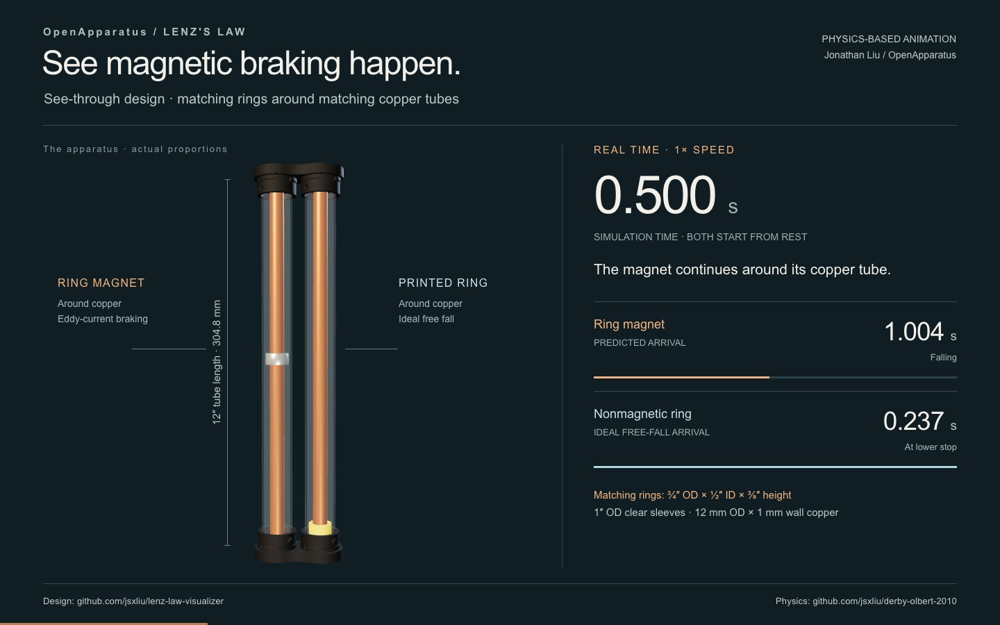

# See-Through Lenz’s Law Visualizer

**An open-source hardware initiative by [OpenApparatus](https://openapparatus.org/)**

[← All designs](../../README.md)

The see-through visualizer makes magnetic braking directly visible. A ring magnet falls around a copper tube, enclosed by a clear polycarbonate tube.

Two parallel drop paths use matching copper and polycarbonate tubes. One contains the ring magnet; the other contains a nonmagnetic, 3D-printed control weight with the same ring geometry.

The moving magnet induces eddy currents in the copper wall. Their magnetic field opposes its motion, slowing its descent. The printed ring provides a free-fall reference, and both descents remain visible through the clear tubes.

Two 3D-printed end caps hold the tubes. Epoxy bonds the polycarbonate tubes to the caps; the copper tubes sit in unbonded sockets.

## Physics-based animation

**[Watch the animation (12.05 seconds)](https://jsxliu.github.io/lenz-law-visualizer/designs/see-through-design/animation/)**

The player includes a **Download video (MP4)** link.

The existing-size ring magnet and matching nonmagnetic control are released
simultaneously, shown at real time and replayed at quarter speed. Predicted
arrivals are **1.004 s** for the magnet and **0.237 s** for the control. The simulation adapts
the cylindrical-magnet field from the
[Derby–Olbert reproduction](https://github.com/jsxliu/derby-olbert-2010)
to the ring geometry; the control follows analytic free fall.

See the [parameters and assumptions](animation/scenario.md) and
[credits and licenses](animation/credits.md).

## 📁 Overview

This folder contains the prototype photograph, two printable STL files, a physics-based animation, and build guidance for the see-through design.

**Included files:**

* [animation/](animation/README.md) — Video player, MP4, scenario, and credits

* [see-through-design-hero.jpg](images/see-through-design-hero.jpg) — Prototype photograph
* [see_through_design_end_cap_v1.stl](parts/see_through_design_end_cap_v1.stl) — See-through end cap; print two
* [free_fall_ring_v1.stl](parts/free_fall_ring_v1.stl) — Ring-shaped control weight; print one
* `README.md` — Project overview, safety notes, and build guidance

## 💡 Motivation

I enjoy building physical models that make abstract science ideas easier to see and explain. This project combines physics, mechanical design, 3D printing, and technical communication. The see-through variation addresses the limited visibility of a magnet inside an opaque conducting tube by moving a ring magnet around the outside of the conductor.

## ⚠️ Safety & Liability

* **Captive system:** The end caps and cured adhesive joints keep the falling objects enclosed. Inspect the caps, tubes, and adhesive joints before every demonstration. Do not use the apparatus if any part is cracked, loose, displaced, or damaged.
* **Strong magnets:** Keep the apparatus away from implanted medical devices, magnetic storage, electronics, and ferromagnetic objects. Follow the magnet manufacturer’s handling and separation guidance.
* **Adhesives and chemical exposure:** Avoid skin and eye contact with uncured resin, hardener, and mixed epoxy. Wear gloves compatible with the selected product, safety goggles, and protective clothing. Perform syringe injection in a well-lit, well-ventilated workspace with a protected work surface, separated from bystanders. Follow the product’s Safety Data Sheet for handling, cleanup, disposal, and first aid.
* **Supervision:** Assemble and operate the apparatus under qualified adult supervision.

## 🛠️ Bill of Materials (Per Kit)

### Hardware

* 2x Inner Copper Tubes: Matching tubes, each with a 12 mm outside diameter and 1 mm wall thickness (10 mm calculated inside diameter). Choose stock at least as long as the actual polycarbonate tubes, then trim to match their length.
* 2x Outer Clear Tubes: Matching polycarbonate tubes, each with a 0.87-inch inside diameter, 1-inch outside diameter, and nominal 12-inch length. Each surrounds an inner copper tube and a falling ring.
* 1x Magnet: Permanent ring magnet (annular cylinder), with a 1/2-inch inside diameter, 3/4-inch outside diameter, and 3/8- inch height.
* 1x Control Weight: Nonmagnetic, 3D-printed ring cylinder with the same geometry as the magnet: 1/2-inch inside diameter, 3/4-inch outside diameter, and 3/8-inch height.

**Why 12 mm copper OD:** The magnet’s 1/2-inch (12.7-mm) inside diameter limits the copper-tube outside diameter. The selected maximum OD for this design is **12 mm**, leaving 0.7 mm diametral clearance, or a nominal **0.35 mm radial gap** when centered. The magnet’s terminal velocity and resulting drop time depend strongly on this gap. The 12-mm OD keeps the gap small while providing clearance for free sliding.

**Tube lengths:** 12-inch is exactly **304.8-mm**, not 300-mm. Tubes listed online as 300-mm may arrive as exact 12-inch lengths; measure the actual tubes before cutting. Both polycarbonate tubes must have the same length, and both copper tubes must match that measured length. If a copper tube is too short, obtain longer stock.

### Adhesives

* **Epoxy:** [WEST SYSTEM G/flex 650 Toughened Epoxy](https://www.westsystem.com/products/g-flex-650-toughened-epoxy/). Mix resin and hardener thoroughly **1:1 by volume**.
* **Application:** Bond the four polycarbonate-to-end-cap joints. The copper tubes remain seated without adhesive.
* **Cure:** Keep the assembly supported and undisturbed for at least **24 hours at 72°F (22°C)** after the final injection before handling or use. Allow longer cure time in cooler conditions.

Follow the manufacturer’s [application instructions](https://www.westsystem.com/app/uploads/2022/12/650-K-Aluminum-Kit-Instruction.pdf) and [resin and hardener Safety Data Sheets](https://www.westsystem.com/safety/safety-data-sheets/).

### 3D-Printed Parts

* 2x See-Through End Caps: Each locates the two inner copper tubes and two outer polycarbonate tubes and includes the adhesive injection and vent ports. **Print file:** [see_through_design_end_cap_v1.stl](parts/see_through_design_end_cap_v1.stl).
* 1x Ring-Shaped Control Weight: Match the magnet’s inside diameter, outside diameter, and height for a fair comparison. Confirm that the printed ring slides freely around its copper tube and inside its clear tube. **Print file:** [free_fall_ring_v1.stl](parts/free_fall_ring_v1.stl).

## 🖨️ 3D-Printer Settings (PETG Starting Material)

Use these settings as a starting point for the included STL files. Check the printed parts’ fit and the filament’s compatibility with the epoxy before assembly.

**End Caps — Starting Settings:**

* **Strength — Wall Loops:** 6
* **Strength — Sparse Infill:** 18% density, gyroid pattern

**3D-Printed Ring Control Weight:**

* **Strength — Sparse Infill Density:** 100%
* **Strength — Sparse Infill Pattern:** Rectilinear

## ⚙️ Assembly Procedure

**Required Tools & Accessories:**

* Copper tube cutter and, if needed, a cutting tool suitable for polycarbonate
* Reaming pen or deburring tool
* Caliper and tape measure
* Epoxy mixing cups and stirrers
* Glue applicator syringe with a blunt-tip needle, sealing cap, and dispensing tips, used to inject the mixed epoxy into the end-cap ports
* Product-compatible protective gloves, safety goggles, and protective clothing
* Protected work surface and supports that maintain tube and cap alignment during curing

**Assembly Steps:**

1. **Prepare the tubes:** Measure both polycarbonate tubes and confirm they are the same length. Use that actual length as the reference for both copper tubes. If a copper tube is longer, use a copper tube cutter to trim it to match; replace any copper tube that is too short with longer stock. Use a deburring tool to clean the inside and outside edges of cut or rough tube ends as needed, remove debris, and confirm all four tubes have the same final length. Prepare the bonding surfaces according to the adhesive manufacturer’s instructions for each material.
2. **Print and inspect the parts:** Print two end caps and one ring-shaped control weight. Reject parts with cracks, weak layers, obstructed sockets, or malformed injection and vent ports. Remove rough edges and debris from the control weight’s travel surfaces.
3. **Check the individual travel paths:** Slide the ring magnet around one copper tube and the control weight around the other. Check each inside its polycarbonate outer tube. Both rings must travel freely without catching on the copper, clear tube, or end-cap seating surfaces.
4. **Seat the first cap:** Insert both inner copper tubes into their sockets in one end cap. Seat the matching outer polycarbonate tube around each copper tube. Keep each pair concentric and fully seated against its designated stops.
5. **Load the falling objects:** Slide the ring magnet over the copper tube in one path and the printed ring control weight over the copper tube in the other. Keep each object inside its outer polycarbonate tube.
6. **Fit the second cap:** Align the inner and outer sockets and place the second end cap onto all four tubes. Confirm that every tube remains fully seated and that both paths stay aligned.
7. **Perform the initial function check:** With both unbonded caps held together using both hands, gently flip the apparatus several times. Confirm that the magnet and control weight both travel smoothly from end to end.
8. **Prepare for adhesive injection:** Set up the well-lit, well-ventilated workspace, put on the required gloves and goggles, and support the aligned assembly. Identify the injection and vent ports for each local tube-to-cap joint. Prepare and load the epoxy according to its specified mix ratio and working time.
9. **Inject and distribute epoxy at one joint:** Orient the joint so its injection port is below its vent port. Inject slowly through the lower port until epoxy first appears at the upper vent. Stop before excess adhesive enters the falling path. While the epoxy is workable, gently rotate the polycarbonate tube within its socket to help distribute adhesive around the bonding interface, without unseating the tube or disturbing alignment. Rotation helps distribute adhesive; the socket geometry controls the bond gap.
10. **Repeat at the remaining joints:** Repeat the injection and distribution process for the other three outer-polycarbonate-to-cap joints, covering both ends of both clear tubes. Keep all tubes seated. Complete any rotation before the epoxy at either end of that tube begins to set; then leave the tube undisturbed. The inner copper tubes remain captured in their sockets; do not inject adhesive into their seats or the rings’ travel paths.
11. **Allow the adhesive to cure:** Keep the assembly supported and undisturbed for at least 24 hours at 72°F (22°C) after the final injection; allow longer in cooler conditions. Follow the cure guidance in [Adhesives](#adhesives).
12. **Inspect and perform the final function check:** Once full cure is complete, inspect every bond, tube seat, and cap. Confirm that the copper tubes are retained, neither cap can separate during normal operation, and no adhesive obstructs either ring’s travel. Manually turn the completed apparatus over several times and confirm that both objects still travel smoothly.

## 🔬 Use and Expected Observations

Move both falling objects to the same end of the completed apparatus. Turn it over to release them together and observe both rings through the clear polycarbonate tubes.

* **Control path:** The nonmagnetic, printed ring falls quickly, providing the free-fall reference.
* **Magnet path:** The ring magnet falls more slowly because its motion induces eddy currents in the inner copper tube.

Both rings remain visible throughout their descent. Mechanical friction effects are usually negligible in this type of setting and design.

## 📄 License

This project is licensed under the **CERN Open Hardware Licence Version 2 – Weakly Reciprocal (CERN-OHL-W-2.0)**. Please see the [repository LICENSE](../../LICENSE) file for the full license text.

The animation text, video, poster, and synthesized landing sounds use
[CC BY 4.0](animation/LICENSE-media); the viewer uses
[MIT](animation/LICENSE-viewer). See [component credits](animation/credits.md).

## ✍️ Attribution

Created by Jonathan Liu. If you build from or adapt this project, please preserve attribution and clearly indicate your modifications.

## 📝 Notes

This repository documents an authentic learning and design process. The project may evolve as testing, classroom use, and fabrication experience lead to improvements.

## 🌍 Get Involved with OpenApparatus

This repository is maintained by the **OpenApparatus** engineering team. We are dedicated to removing financial barriers to advanced physics and engineering education.

* **Educators:** Want to deploy this hardware in your classroom? [Request a Beta-Test Donation](https://openapparatus.org/beta.html).
* **Students:** Want to manufacture these kits for underfunded schools in your area? [Apply to Start a Chapter](https://forms.gle/mwWGrnZB5XusfW3L9).
* **Learn more:** Visit [openapparatus.org](https://openapparatus.org/) to see our full library of open-source STEM modules and latest deployment impact metrics.
