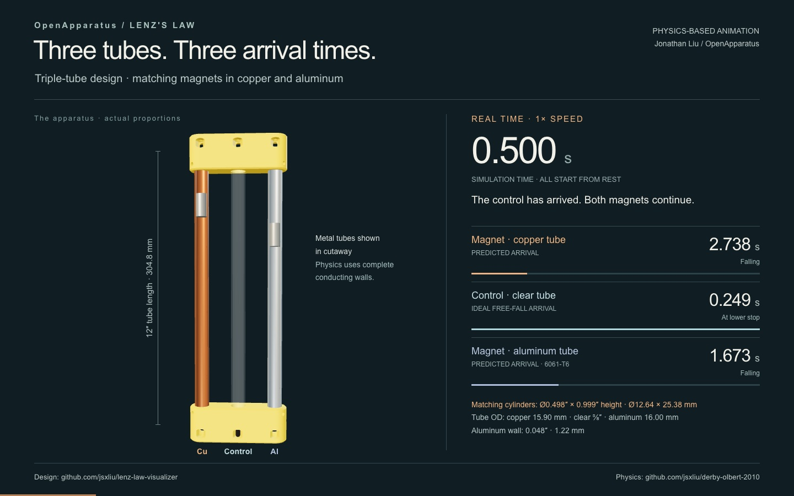

# Triple-Tube Lenz’s Law Visualizer

**An open-source hardware initiative by [OpenApparatus](https://openapparatus.org/)**

[← All designs](../../README.md)

**Release:** v1

The triple-tube visualizer extends the dual-tube design with an aluminum tube so students can compare how conductor material affects magnetic braking. It has three parallel drop paths: a control weight in the clear polycarbonate tube, one permanent magnet in the aluminum tube, and one permanent magnet in the copper tube.

When all three objects are released together, the control weight falls fastest. The magnet in the aluminum tube falls more slowly, and the magnet in the copper tube falls slowest.

As a magnet moves through a conductive tube, its changing magnetic field induces eddy currents in the tube wall. Those currents create a magnetic field that opposes the magnet’s motion. Copper produces a stronger braking effect than aluminum in this apparatus, making the effect of material conductivity visible in a single demonstration.

The triple-tube and dual-tube designs share component specifications wherever practical. The triple-tube version adds an aluminum comparison tube and redesigned end caps that hold all three tubes.

## Physics-based animation

**[Watch the animation (20.72 seconds)](https://jsxliu.github.io/lenz-law-visualizer/designs/triple-tube-design/animation/)**

The player includes a **Download video (MP4)** link.

The three weights release together; a real-time fall is followed by a
quarter-speed replay. Copper and aluminum trajectories use the same
[Derby–Olbert reproduction](https://github.com/jsxliu/derby-olbert-2010)
as the dual-tube animation, while the control follows ideal free fall.
Predicted arrivals are **0.249 s** for the control, **1.673 s** for the
aluminum magnet, and **2.738 s** for the copper magnet. The metal cutaways
are visual only; the modeled tube walls remain electrically intact.

The movie uses the physics report’s aluminum geometry at a 12-inch length:
**16.00 mm OD × 13.56 mm ID × 1.22 mm wall**
(approximately **0.630″ OD × 0.534″ ID × 0.048″ wall**).

See the [parameters and assumptions](animation/scenario.md) and
[credits and licenses](animation/credits.md).

## 📁 Overview

This folder contains the prototype photograph, printable parts, a physics-based animation, and build documentation for the triple-tube design.

**Included files:**

* [cap_triple_tube_design_v1.stl](parts/cap_triple_tube_design_v1.stl) — Triple-tube end cap; print two
* [control_weight_cylinder_3D_print_v1.stl](parts/control_weight_cylinder_3D_print_v1.stl) — Optional 3D-printable control weight; print one
* [triple-tube-design-hero.jpg](images/triple-tube-design-hero.jpg) — Prototype photograph
* [animation/](animation/README.md) — Physics-based video, player, scenario, and credits
* `README.md` — Project overview, safety notes, and build guidance

## 💡 Motivation

I enjoy building physical models that make abstract science ideas easier to see and explain. This project combines physics, mechanical design, 3D printing, and technical communication. It is part of my broader interest in using hardware to turn mathematical and physical concepts into tangible learning experiences.

## ⚠️ Safety & Liability

* **Captive system:** The end caps and fasteners keep the magnets and control weight enclosed. Inspect the caps, tubes, inserts, and fasteners before every demonstration, and do not use the apparatus if any part is cracked, loose, or damaged.
* **Strong magnets:** Keep the apparatus away from implanted medical devices, magnetic storage, electronics, and ferromagnetic objects. Follow the magnet manufacturer’s handling and separation guidance.
* **Pinch, impact, and shatter hazards:** Keep fingers and loose metal objects away from the magnets. Do not use cracked or chipped magnets.
* **Hot surfaces and sharp edges:** Assembly requires cutting and deburring tubes and heat-setting threaded inserts. Wear appropriate protection and handle cutting tools, hot tools, and metal edges carefully.
* **Supervision:** Assemble and operate the apparatus under qualified adult supervision.

## 🛠️ Bill of Materials (Per Kit)

### Hardware

* 1x Copper Tube: Nominal 1/2-inch Type L or Type M copper tube, actual OD approximately 5/8 inch, cut to 12 inches.
* 1x Clear Tube: Polycarbonate, 5/8-inch OD × 1/2-inch ID × 1/16-inch wall, cut to 12 inches.
* 1x Aluminum Tube: 6061-T6 drawn aluminum round tube, 5/8-inch OD × 0.035-inch wall × 0.555-inch ID, cut to 12 inches.
* 2x Magnets: Neodymium cylinders, nominal 1/2-inch diameter × 1 inch long. Use two magnets with matching dimensions and magnetic properties.
* 1x Control Weight — choose one option:
  * **Off-the-shelf:** 316 stainless steel dowel pin matching the nominal size of the magnet.
  * **3D-printed:** Print [control_weight_cylinder_3D_print_v1.stl](parts/control_weight_cylinder_3D_print_v1.stl).

### Fasteners

The triple-tube design uses the same fastener specifications as the [dual-tube design](../dual-tube-design/README.md), with twice the quantity of inserts and set screws:

* 12x Ruthex M3 threaded inserts, RX-M3x5x4 brass heat-set type.
* 12x M3-0.5 × 5 mm hex socket set screws, cup point.
* Loctite 242 blue removable threadlocker, as needed.

### 3D-Printed Parts

* 2x Triple-Tube End Caps: Print [cap_triple_tube_design_v1.stl](parts/cap_triple_tube_design_v1.stl).
* 1x Control-Weight Cylinder (optional): Print [control_weight_cylinder_3D_print_v1.stl](parts/control_weight_cylinder_3D_print_v1.stl) instead of using the stainless steel dowel pin.

## 🖨️ 3D-Printer Settings (PETG Filament Recommended)

The triple-tube and dual-tube designs use the same printing approach:

**End Caps:**

* **Strength — Wall Loops:** 6
* **Strength — Sparse Infill:** 18% density, gyroid pattern

**3D-Printed Control Weight:**

* **Strength — Sparse Infill Density:** 100%
* **Strength — Sparse Infill Pattern:** Rectilinear

The control weight has a small print volume, so 100% rectilinear infill is recommended.

## ⚙️ Assembly Procedure

**Required Tools & Accessories:**

* Tube-cutting tools suitable for copper, aluminum, and polycarbonate
* Reaming pen or deburring tool
* Soldering iron or heat-insert tool
* Metric hex key for M3 set screws
* Caliper and tape measure
* Loctite 242 blue removable threadlocker

**Assembly Steps:**

1. **Prepare the tubes:** Cut the copper, polycarbonate, and aluminum tubes to 12 inches. Deburr the inside and outside edges of every cut end.
2. **Check free travel:** Over a padded surface, pass each magnet through its metal tube and the selected control weight through the clear tube. Confirm that every object travels from end to end without binding.
3. **Print and inspect the parts:** Print two triple-tube end caps and, if selected, one control-weight cylinder. Reject parts with cracks, weak layers, obstructed sockets, or malformed fastener holes.
4. **Install the inserts:** Temporarily seat the matching copper or aluminum tube in each outer socket so the tube acts as a depth stop for the adjacent inserts. Heat-set six threaded inserts squarely into each end cap until they are flush with the plastic. Use the correct tool temperature for the selected filament. Remove each temporary tube after the inserts and surrounding plastic have cooled completely, then allow the installed inserts to remain unloaded overnight before continuing.
5. **Seat the tubes:** Insert the copper and aluminum tubes into the two outer sockets and the clear polycarbonate tube into the center socket of the bottom cap. Seat all three tubes against their internal stops.
6. **Load the falling objects:** Place one matching magnet in the copper tube, the other matching magnet in the aluminum tube, and the selected control weight—the stainless steel dowel pin or the 3D-printed cylinder—in the clear tube. Use one control-weight option, not both.
7. **Fit the second cap:** Align the sockets and press the second end cap fully onto all three tubes. Do not invert the apparatus until both caps have been fastened.
8. **Secure the assembly:** Install six set screws in each end cap: three against the copper tube and three against the aluminum tube. Apply a small amount of removable threadlocker to the screw threads and tighten the screws evenly until snug. Do not overtighten or deform the tube walls.
9. **Allow the threadlocker to cure:** Leave the assembly undisturbed for at least 24 hours at room temperature, or longer if required by the threadlocker manufacturer for the working conditions.
10. **Inspect the captive system:** Confirm that all 12 set screws are secure, both caps are fully seated, and none of the falling objects can leave the apparatus.
11. **Perform the function check:** Over a padded surface, flip the secured apparatus several times. Confirm that both magnets and the control weight travel from end to end without binding.

The apparatus is ready for its comparative drop demonstration after the retention and function checks pass.

## 🔬 Use and Expected Observations

Move all three falling objects to the same end of the apparatus. Turn the apparatus over to release them together and observe their relative descent times.

The observed fastest-to-slowest order is:

1. **Clear tube:** The control weight falls fastest, providing the free-fall reference.
2. **Aluminum tube:** The magnet falls more slowly because of eddy-current braking.
3. **Copper tube:** The magnet falls slowest because copper produces the strongest braking effect in this apparatus.

This single action shows both the contrast between free fall and magnetic braking and the effect of conductor material on falling speed.

## 📌 Versioning

**v1 — Initial public release.** The release tag is `triple-tube-design-v1`, and the end-cap filename uses the same v1 design identifier.

## 📄 License

This project is licensed under the **CERN Open Hardware Licence Version 2 – Weakly Reciprocal (CERN-OHL-W-2.0)**. Please see the [repository LICENSE](../../LICENSE) file for the full license text.

The animation has separate [media](animation/LICENSE-media) and
[viewer](animation/LICENSE-viewer) licenses; see its [credits](animation/credits.md).

## ✍️ Attribution

Created by Jonathan Liu. If you build from or adapt this project, please preserve attribution and clearly indicate your modifications.

## 📝 Notes

This repository documents an authentic learning and design process. The project may evolve as testing, classroom use, and fabrication experience lead to improvements.

## 🌍 Get Involved with OpenApparatus

This repository is maintained by the **OpenApparatus** engineering team. We are dedicated to removing financial barriers to advanced physics and engineering education.

* **Educators:** Want to deploy this hardware in your classroom? [Request a Beta-Test Donation](https://openapparatus.org/beta.html).
* **Students:** Want to manufacture these kits for underfunded schools in your area? [Apply to Start a Chapter](https://forms.gle/mwWGrnZB5XusfW3L9).
* **Learn more:** Visit [openapparatus.org](https://openapparatus.org/) to see our full library of open-source STEM modules and latest deployment impact metrics.
